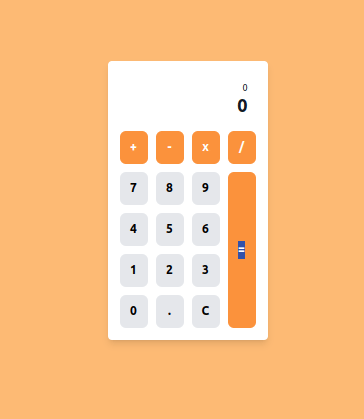

# Simple Calculator App

Welcome to the Simple Calculator App! This project is a functional and user-friendly calculator built using HTML, CSS, and JavaScript. It performs basic arithmetic operations and is designed with a clean, intuitive interface.

## Features

- **Basic Arithmetic Operations**: Addition, subtraction, multiplication, and division.
- **Decimal Support**: Handles decimal numbers and ensures correct results.
- **Clear Functionality**: Resets the calculator for new calculations.
- **Responsive Design**: Adaptable interface for various screen sizes.

## Technologies Used

- **HTML**: For structuring the web page and creating the layout of the calculator.
- **TailWind**: For styling the calculator and making the UI visually appealing.
- **JavaScript**: For implementing the calculator logic and handling user interactions.

## Live Demo

You can view the live project deployed on GitHub Pages [here](https://kenvastolord.github.io/Simple_calculator_app/).

## Screenshots



## Getting Started

### Installation

1. **Clone the Repository**

   ````bash
   git clone https://github.com/kenvastolord/Simple_calculator_app   ```

   ````

2. **Navigate to the Project Directory**

```bash
  cd Simple_calculator_app
```

## Usage

- **Entering Numbers**: Click on the number buttons to input numbers.
- **Selecting Operators**: Click on the operator buttons (`+`, `-`, `x`, `/`) to choose the operation you want to perform.
- **Calculating Results**: Press the `=` button to get the result of the calculation.
- **Clearing Input**: Press the `C` button to reset the calculator and start a new calculation.

## JavaScript Functions

- **`appendNumber(number)`**: Adds the clicked number to the current input.
- **`chooseOperator(selectedOperator)`**: Sets the operator and prepares for the next number input.
- **`calculate()`**: Computes the result based on the previous and current inputs.
- **`clearCalculator()`**: Resets all inputs and displays.
- **`evaluateExpression(a, operator, b)`**: Performs the arithmetic operation based on the selected operator.

## Contributing

Feel free to open an issue or submit a pull request if you have suggestions or improvements. Contributions are welcome!

## Acknowledgments

- Inspiration from various online calculators.
- Thanks to the open-source community for continuous support and resources.
